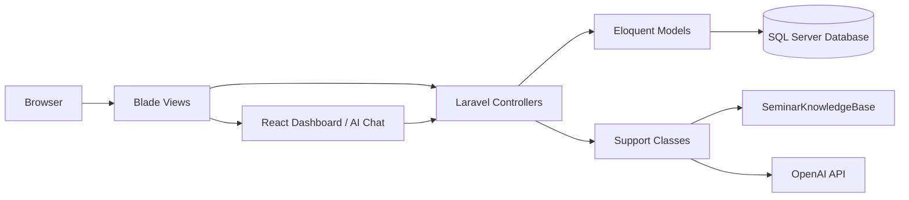

# Kiến Trúc Laravel Boost Trong Seminar Manager

Tài liệu này giải thích cách Laravel Boost liên quan đến dự án Seminar Manager, và vì sao kiến trúc hiện tại phù hợp để AI hiểu đúng codebase hơn.

Nếu bạn cần bản dễ học thuộc để thuyết trình, xem thêm:

- `LARAVEL_BOOST_SEMINAR_GUIDE.md`

## 1. Laravel Boost Là Gì

Laravel Boost là lớp hỗ trợ AI dành cho dự án Laravel.

Nó không thay thế application của bạn, và cũng không phải là một phần business logic cho người dùng cuối. Vai trò của Boost là:

- giúp AI hiểu cấu trúc dự án
- giúp AI đọc đúng ngữ cảnh Laravel
- giúp AI trả lời hoặc sinh code phù hợp với project hiện tại

Trong Seminar Manager, Boost được dùng như một lớp tri thức và ngữ cảnh cho AI chat.

## 2. Vấn Đề Mà Boost Giải Quyết

Nếu dùng AI chung chung mà không có ngữ cảnh:

- AI có thể đoán sai tên bảng
- AI có thể viết sai route
- AI có thể không hiểu vai trò admin/lecturer/student
- AI có thể trả lời không đúng workflow seminar

Boost giải quyết bằng cách cung cấp:

- ngữ cảnh dự án
- schema database
- route flow
- role permissions
- semantic knowledge về seminar workflow

## 3. Kiến Trúc Tổng Thể

Seminar Manager đang dùng kiến trúc lai:

- Laravel Blade cho phần giao diện chính
- React cho dashboard analytics và AI chat UI
- Laravel controllers cho workflow
- Eloquent models cho dữ liệu
- `SeminarKnowledgeBase` cho dữ liệu tri thức của AI
- `SeminarAiChat` cho logic trả lời AI

## 4. Ba Lớp Quan Trọng Khi Dùng Boost

### 4.1 Application Layer

Đây là phần người dùng nhìn thấy:

- dashboard
- login
- topics
- submissions
- presentations
- AI chat

Boost không thay thế lớp này. Nó chỉ giúp AI hiểu lớp này tốt hơn.

### 4.2 Knowledge Layer

Đây là nơi chứa tri thức dự án:

- `AI_KNOWLEDGE_BASE.md`
- `app/Support/SeminarKnowledgeBase.php`
- `app/Support/SeminarAiChat.php`

Lớp này giúp AI trả lời đúng:

- dự án làm gì
- role nào làm gì
- database nào quan trọng
- flow nào đang chạy

### 4.3 Data Layer

Đây là nơi AI và ứng dụng đọc ngữ cảnh thật:

- `users`
- `topics`
- `registrations`
- `submissions`
- `presentations`
- `scores`
- `activity_logs`
- `ai_chat_conversations`
- `ai_chat_messages`

Boost rất hữu ích khi AI cần hiểu dữ liệu thật thay vì chỉ đoán từ prompt.

## 5. Luồng Hoạt Động Của AI Chat

### Khi không có `OPENAI_API_KEY`

1. User mở AI chat
2. `AiChatController` nhận message
3. `SeminarAiChat` gọi `localReply()`
4. `SeminarKnowledgeBase` chọn câu trả lời phù hợp
5. AI trả về markdown từ knowledge base

Kết quả:

- vẫn dùng được trong demo
- không phụ thuộc internet
- câu trả lời bám sát project

### Khi có `OPENAI_API_KEY`

1. User mở AI chat
2. `AiChatController` nhận message
3. `SeminarAiChat` build instructions
4. `SeminarKnowledgeBase::contextBlock()` được gắn vào prompt
5. OpenAI trả lời với ngữ cảnh dự án

Kết quả:

- AI trả lời linh hoạt hơn
- vẫn bám vào project thật
- giảm nguy cơ hallucination

## 6. Tại Sao Kiến Trúc Này Hợp Với Laravel Boost

Boost phù hợp với dự án này vì project có:

- cấu trúc Laravel rõ ràng
- database nhiều quan hệ
- workflow học thuật cụ thể
- role-based permissions
- AI chat cần context dự án thật

Nói cách khác:

- Laravel giữ phần nghiệp vụ
- Boost giúp AI hiểu nghiệp vụ đó
- knowledge base giữ phần tri thức cốt lõi

## 7. Mối Quan Hệ Giữa Laravel Boost Và Seminar Manager

Trong Seminar Manager:

- `SeminarAiChat` là service giao tiếp với AI
- `SeminarKnowledgeBase` là lớp dữ liệu tri thức
- `AiChatController` là cửa vào HTTP
- `DashboardController` cung cấp dữ liệu hội thoại, analytics, role context
- `README-DEMO.md` và `AI_KNOWLEDGE_BASE.md` mô tả cách dùng

Laravel Boost, theo cách hiểu thực hành trong project này, là lớp giúp:

- đọc codebase
- hiểu route
- hiểu schema
- hiểu data flow
- hiểu ngữ cảnh seminar

## 8. Folder Map Liên Quan

- `routes/web.php` - route chính
- `app/Http/Controllers/AiChatController.php` - luồng AI chat
- `app/Support/SeminarAiChat.php` - logic AI và OpenAI
- `app/Support/SeminarKnowledgeBase.php` - tri thức dự án
- `database/migrations` - schema
- `database/seeders` - demo data
- `resources/views` - UI Blade
- `resources/js` - React components

## 9. Mẫu Tư Duy Khi Giải Thích Cho Giảng Viên

Bạn có thể nói:

> Em không train một mô hình AI mới. Em xây một lớp knowledge base và gắn nó vào AI chat. Khi có OpenAI key thì assistant được bơm thêm ngữ cảnh dự án, còn khi không có key thì local demo vẫn trả lời dựa trên dữ liệu Seminar Manager.

Câu nói này rất hợp để giải thích kiến trúc Laravel Boost trong seminar.

## 10. Kết Luận

Laravel Boost trong Seminar Manager nên được hiểu là:

- một lớp hỗ trợ AI
- không phải phần business logic chính
- dùng để tăng độ chính xác khi AI làm việc với Laravel project
- kết hợp tốt với knowledge base, role context, và database thật

Kiến trúc này giúp project:

- dễ demo
- dễ giải thích
- dễ mở rộng
- và AI trả lời đúng ngữ cảnh hơn
