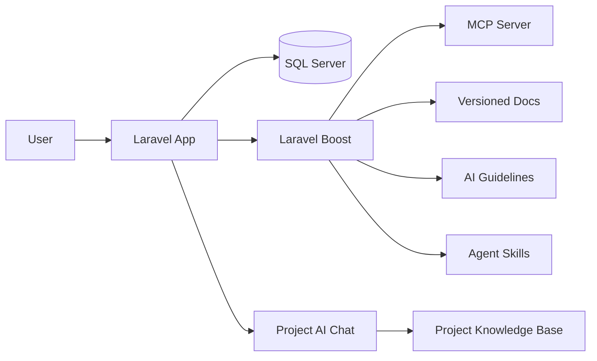

# Laravel Boost Seminar Guide

This document is the presentation-ready guide for explaining Laravel Boost in a seminar.

If you need one file to study before speaking, read this one first.

## 1. What Laravel Boost Is

Laravel Boost is Laravel's AI development assistant package for Laravel projects.

It is designed to help AI agents understand the real state of your application instead of guessing from generic training data.

In practical terms, Boost gives an AI agent:

- project context
- Laravel-specific instructions
- access to versioned documentation
- MCP tools that can inspect the real app

Official references:

- Announcement: https://laravel.com/blog/announcing-laravel-boost
- Docs: https://laravel.com/docs/13.x/boost
- AI landing page: https://laravel.com/ai/boost

## 2. Why Laravel Boost Exists

The problem Boost solves is the AI context gap.

Without project context, an AI agent may:

- invent routes that do not exist
- use the wrong Laravel APIs
- assume the wrong database schema
- miss version-specific differences
- produce code that compiles poorly or fails at runtime

Boost fixes this by giving the agent access to:

- the project's actual Laravel environment
- the installed package versions
- the database schema
- the route list
- logs and browser errors
- versioned Laravel documentation

## 3. The Main Parts of Laravel Boost

Laravel Boost is not just one feature. It is a bundle of AI support tools.

### 3.1 MCP server

Boost ships with a Laravel-specific Model Context Protocol server.

This server lets AI agents inspect the app and take informed actions.

Examples of what the MCP layer can expose:

- application info
- database connections
- database schema
- database queries
- route list
- artisan commands
- configuration values
- last error logs
- browser logs
- Tinker access

### 3.2 AI guidelines

Boost provides Laravel-maintained AI guidelines.

These are not the same as business rules in your app.

They are instructions that help an AI agent:

- follow Laravel conventions
- use the correct APIs for the installed version
- write safer and more reviewable code
- avoid common AI mistakes

### 3.3 Agent skills

Boost also ships with agent skills.

Skills are action-oriented capabilities that guide the agent through common development tasks.

### 3.4 Documentation API

Boost includes a documentation API backed by a large Laravel knowledge base.

The official docs describe it as a version-aware documentation system with more than 17,000 Laravel-specific entries.

That matters because the AI can search the right docs for the installed version instead of returning generic or outdated advice.

## 4. What Laravel Boost Is Not

This is important for the seminar.

Laravel Boost is not:

- a replacement for Laravel itself
- a new frontend framework
- a standalone AI model
- a database engine
- a business feature for end users

It is an AI development aid for the engineering workflow.

## 5. How Boost Relates To This Project

This repository uses Boost as part of the development and AI-assistance workflow.

Current repo-level indicators:

- `composer.json` includes `laravel/boost`
- `boost.json` exists at the project root
- the project has a dedicated AI knowledge base
- the app includes an AI chat assistant for project guidance

In this project, Boost is used conceptually in two places:

1. during development, to help AI agents work with the Laravel codebase
2. during explanation, to ground the AI chat assistant in real project context

## 6. Boost Inside The Seminar Manager Project

The Seminar Manager app is the demonstration project used to show how Boost matters in practice.

The app gives Boost a realistic Laravel context:

- users and roles
- topics
- registrations
- submissions
- presentations
- scores
- activity logs
- dashboard analytics
- AI chat history

That makes the project useful for showing why AI needs context.

## 7. The Architecture Story You Should Explain

Use this story when you present.



### Simple explanation

- Laravel handles the actual application
- SQL Server stores the data
- Boost helps AI understand the application
- the knowledge base gives the AI project-specific facts
- the AI chat shows how the project can answer in-context questions

## 8. What Boost Gives You In Practice

From a practical development point of view, Boost helps with:

- reading the route structure
- checking the database schema
- asking the app about its current state
- getting better code suggestions
- writing tests that match the project
- finding the correct API for the installed Laravel version
- debugging errors using real logs instead of guesses

This is the key seminar message:

> Boost reduces AI guessing by giving the agent real app context.

## 9. Why Boost Matters For This Project

This project is a strong example because it has:

- multiple user roles
- relational data
- file uploads
- review workflow
- reporting and analytics
- a custom AI chat assistant

That means Boost has meaningful context to work with.

If the AI knows the schema, routes, and rules, it can assist the project much better than a generic prompt.

## 10. Installation Summary

The project already includes Boost in `composer.json`.

If you want to explain installation in class, keep it high level:

```bash
composer require laravel/boost --dev
php artisan boost:install
```

The install process typically adds or updates:

- `boost.json`
- MCP configuration
- AI guideline files
- agent-specific instructions

## 11. Files In This Repository That Matter

These files are the ones you should mention in your presentation.

- `composer.json` - Boost dependency
- `boost.json` - Boost configuration
- `LARAVEL_BOOST_SEMINAR_GUIDE.md` - this presentation guide
- `LARAVEL_BOOST_ARCHITECTURE.md` - technical architecture explanation
- `AI_KNOWLEDGE_BASE.md` - curated facts for the AI assistant
- `app/Support/SeminarAiChat.php` - AI assistant logic
- `app/Support/SeminarKnowledgeBase.php` - local knowledge base
- `app/Http/Controllers/AiChatController.php` - AI chat route handler

## 12. Presentation Structure

If you are speaking to a lecturer, use this order:

1. introduce what Laravel Boost is
2. explain the AI context problem
3. explain the main Boost components
4. show how the project uses Boost context
5. explain the local AI knowledge base
6. show how the AI chat works in the app
7. explain why this is useful for Laravel development
8. mention limitations and beta status

## 13. Short Speaking Script

You can say this:

> Laravel Boost is Laravel's AI development package. It helps AI agents understand the real project context, such as routes, schema, logs, and versioned documentation. In my project, Boost is useful because the Seminar Manager app has roles, workflows, and a relational database that the AI needs to understand correctly. Instead of guessing, the assistant can rely on project-specific context and a local knowledge base.

## 14. Common Lecturer Questions

### Is Boost a model?

No. It is not an AI model. It is a development assistant layer and context provider.

### Does Boost replace Laravel?

No. Laravel is still the application framework. Boost only helps AI work with the project.

### Why not just use normal ChatGPT?

Normal chat does not know your actual routes, schema, or installed package versions. Boost gives the AI the real project context.

### What is the benefit in your project?

It makes AI responses more accurate, helps debugging, and helps explain the codebase in a version-aware way.

## 15. Limitations You Should Mention

Be honest about the limitations.

- Boost is still an AI aid, not a guarantee of correct code
- generated code must still be reviewed
- versioned docs are helpful, but you still need tests
- some behavior can change as the package is still evolving

## 16. Key Takeaway

Laravel Boost is best understood as a context engine for AI-assisted Laravel development.

It gives the agent:

- real application data
- versioned documentation
- Laravel conventions
- tools for inspecting the project

That is why it is more useful than a generic AI chat when you are building a Laravel project.
