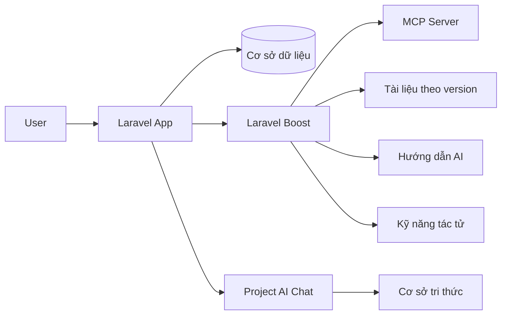

# Hướng Dẫn Thuyết Trình Laravel Boost

Đây là tài liệu bạn nên đọc đầu tiên nếu đề tài seminar là **Laravel Boost**.

Demo project chỉ là project minh hoạ để Laravel Boost có ngữ cảnh thật.

## 1. Laravel Boost là gì?

Laravel Boost là công cụ hỗ trợ AI cho dự án Laravel.

Mục đích của Boost là giúp AI hiểu đúng project thật thay vì chỉ đoán theo kiến thức chung.

Boost cung cấp:

- ngữ cảnh dự án
- hướng dẫn theo chuẩn Laravel
- tài liệu version-aware
- công cụ MCP để đọc trạng thái thực của ứng dụng

## 2. Boost giải quyết vấn đề gì?

Không có ngữ cảnh dự án, AI dễ:

- đoán sai route
- đoán sai bảng dữ liệu
- dùng sai API Laravel
- trả lời theo version cũ
- sinh code không khớp project thật

Boost giảm lỗi đó bằng cách cho AI đọc:

- schema
- route
- log
- tài liệu đúng version
- thông tin runtime của dự án

## 3. Boost gồm những phần nào?

### MCP server

Cho AI đọc app theo kiểu có cấu trúc.

### AI guidelines

Cho AI biết nên viết code theo chuẩn Laravel nào.

### Agent skills

Cho AI các kỹ năng hướng dẫn từng task phát triển.

### API tài liệu

Cho AI tra đúng tài liệu Laravel theo version đang dùng.

## 4. Boost không phải là gì?

Boost không phải:

- framework giao diện
- database
- model AI
- business feature cho user cuối

Boost là lớp hỗ trợ AI cho luồng phát triển.

## 5. Project demo này dùng để làm gì?

Demo project được dùng để minh hoạ Boost trong ngữ cảnh thực tế.

Project có:

- user role
- topic
- registration
- submission
- presentation
- score
- AI chat
- activity log

Nhờ đó AI có đủ ngữ cảnh để trả lời đúng hơn.

## 6. Kiến trúc phải hiểu

### Nói đơn giản

- Laravel chạy ứng dụng
- Database lưu dữ liệu
- Boost giúp AI hiểu project
- Cơ sở tri thức giúp AI trả lời đúng ngữ cảnh
- AI chat là nơi bạn demo kết quả

## 7. Trong project này Boost thể hiện ở đâu?

Các file cần nhớ:

- `composer.json` -> có `laravel/boost`
- `boost.json` -> cấu hình Boost
- `AGENTS.md` -> hướng dẫn agent chính trong repo
- `.github/skills/*` -> skills theo domain
- `.vscode/mcp.json` -> MCP server cho agent
- `app/Support/SeminarAiChat.php` -> logic trả lời AI
- `app/Support/SeminarKnowledgeBase.php` -> cơ sở tri thức nội bộ
- `app/Http/Controllers/AiChatController.php` -> nhận request chat
- `docs/AI_KNOWLEDGE_BASE.md` -> mô tả dữ liệu tri thức

## 8. Dùng gì khi không có khóa OpenAI?

Project vẫn chạy được.

AI chat sẽ dùng chế độ demo cục bộ:

- không cần internet
- không cần khóa API
- vẫn trả lời được theo cơ sở tri thức

Đây là điểm rất hay để demo trong lớp.

## 9. Nói với giảng viên thế nào?

Bạn có thể nói:

> Laravel Boost không phải là model AI, mà là lớp hỗ trợ AI cho Laravel. Em dùng một demo project cùng cơ sở tri thức nội bộ để minh hoạ cách Boost giúp AI hiểu đúng ngữ cảnh của mã nguồn.

## 10. Cái gì là trọng tâm của seminar?

Trọng tâm không phải là xây một hệ thống seminar lớn.

Trọng tâm là:

- hiểu Boost là gì
- hiểu Boost giải quyết vấn đề gì
- hiểu Boost cần ngữ cảnh gì từ project
- hiểu AI chat trong repo được gắn với ngữ cảnh ra sao

## 11. Câu chốt ngắn

> Laravel Boost giúp AI hiểu đúng project Laravel bằng ngữ cảnh, tài liệu, schema và công cụ hỗ trợ. Demo project chỉ là bối cảnh để minh hoạ cách Boost hoạt động trong thực tế.
